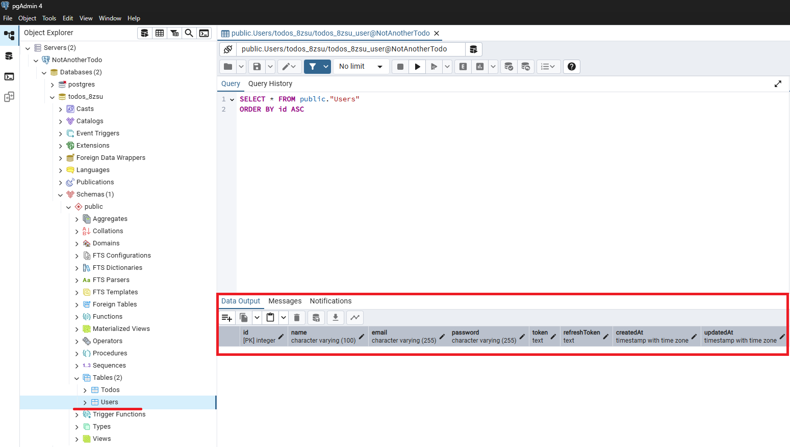
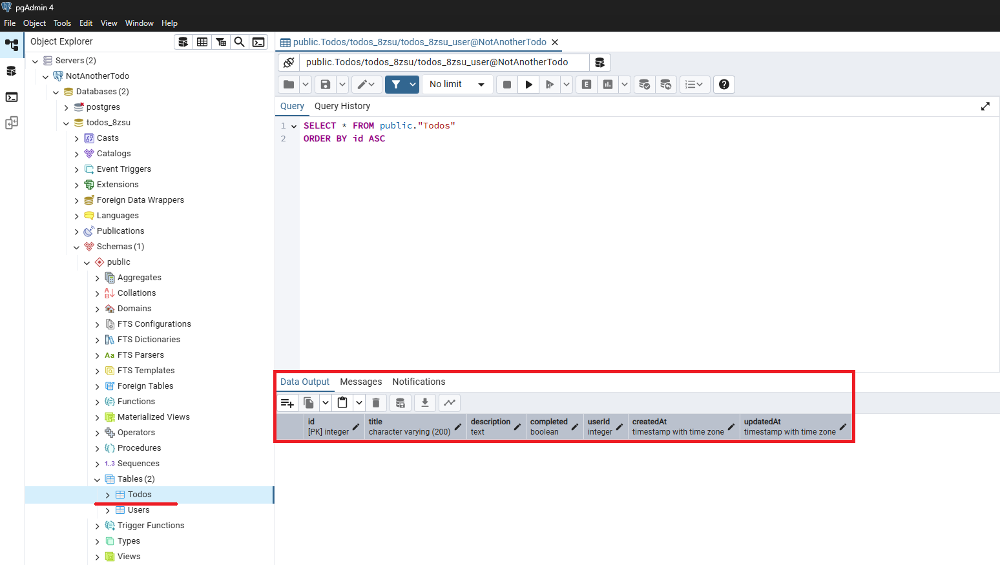

# NotAnotherTodo App Backend

REST API for TODO management with JWT authentication.

## 📚 Documentation

**Live API Documentation:** [https://notanothertodo.onrender.com/api-docs](https://notanothertodo.onrender.com/api-docs)

> ⚠️ **Note:** The server may take ~30 seconds to wake up on first request due to Render's free tier sleep mode.

## 🚀 Features

- JWT Authentication (Access + Refresh tokens)
- CRUD operations for TODO items
- User registration and login
- Password management
- PostgreSQL database
- Swagger documentation
- TypeScript support

## 🛠️ Tech Stack

- **Runtime:** Node.js
- **Language:** TypeScript
- **Framework:** Express.js
- **Database:** PostgreSQL
- **ORM:** Sequelize
- **Authentication:** JWT
- **Documentation:** Swagger UI


## 🗄️ Database Schema

**Users Table**



**Todos Table**




## 🌐 API Endpoints

### Authentication
- `POST /api/auth/register` - Register user
- `POST /api/auth/login` - Login user  
- `POST /api/auth/logout` - Logout user
- `POST /api/auth/refresh` - Refresh access token

### Users
- `GET /api/users/me` - Get current user
- `PUT /api/users/change-password` - Change password

### Todos
- `GET /api/todos` - Get all user todos
- `POST /api/todos` - Create new todo
- `GET /api/todos/:id` - Get todo by ID
- `PUT /api/todos/:id` - Update todo
- `DELETE /api/todos/:id` - Delete todo

## 🏃‍♂️ Local Development

```bash
# Install dependencies
npm install

# Set up environment variables
cp .env.example .env
# Fill in your database credentials and JWT secret

# Run development server
npm run dev

# Build for production
npm run build

# Start production server
npm start
```

## 📖 API Testing

Visit the Swagger documentation at `/api-docs` to test all endpoints directly in your browser.

## 🚀 Deployment

Deployed on Render.com with automatic builds from the main branch.